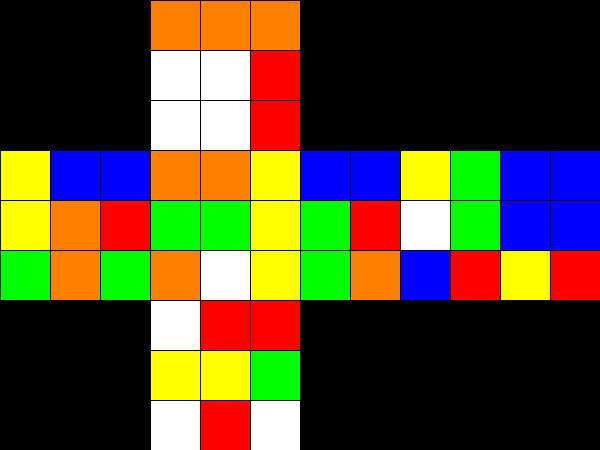

# Rubik's Solver

Reinforcement learning agent that learns to solve Rubik's Cubes, built with
[Gymnasium](https://gymnasium.farama.org/) and
[Stable-Baselines3](https://stable-baselines3.readthedocs.io/) (PPO), with a
built-in PIL visualizer.



## Setup

```bash
pip install -r requirements.txt
```

Then open `RubiksCubeSolverGymnasium.ipynb` and run it top to bottom.

## How it works

- **`RubkisCube`** — the cube simulation. Move mechanics are unit-tested:
  `move⁴ == identity`, `move · move' == identity`, scramble+reverse round-trips,
  and every color always appears exactly 9 times.
- **`CubeEnv`** — the Gymnasium environment.
  - Observations are a **one-hot** encoding of the 54 stickers (54 × 6 = 324
    binary features) so the MLP never treats colors as ordered numbers.
  - Episodes end with `terminated` when solved and `truncated` when the move
    budget runs out — kept distinct so PPO bootstraps values correctly.
- **Curriculum learning** — training starts at 1-move scrambles and
  automatically deepens the scramble once the agent reliably solves the current
  depth (`CurriculumCallback`). This is what makes learning tractable; solving a
  deep scramble cold is nearly impossible.
- **Vectorized envs** — PPO collects experience from several envs in parallel
  for a big speedup.

## After training: measuring performance

The notebook's evaluation section includes:

- `evaluate_solve_rate(...)` — the metric that actually matters: **solve rate**
  and average solution length at a given scramble depth.
- A **solve-rate vs scramble-depth** benchmark comparing the trained agent
  against a random baseline (saved to `docs/solve_rate.png`).
- A **solution-length histogram**.
- `solve_and_render(...)` — solves a single cube, prints the scramble and the
  move sequence it found, and can export an animated GIF of the solve.

Live training curves (including the custom `curriculum/scramble_depth` and
`rollout/solve_rate` metrics):

```bash
tensorboard --logdir Training/Logs
```
